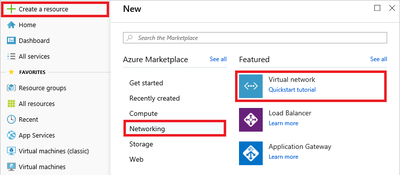
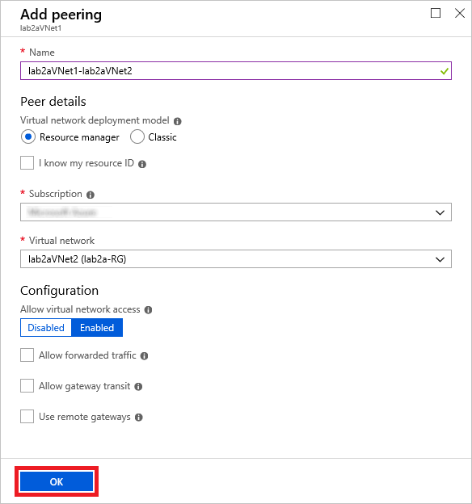

# Module 2: Azure Virtual Network service and components

### Lab A: Creating and configuring virtual networks

In this lab, you will use the Azure portal to create a pair of Azure virtual networks (VNets) and configure them for VNet peering. Then you will create new virtual machines and deploy them into those networks.

```
Perform the exercises in this lab in the Windows Server 2016 VM that you created in Module 1, Lab A.
```

## Exercise 1 - Create virtual networks

In this exercise, you will use the Azure portal to create a pair of virtual networks. Then you will add peerings to peer the networks together. Peering enables traffic to move seamlessly between two networks as if they were the same network.

### Task 1: Create virtual networks using the Azure Portal

1.  Navigate to the Azure portal at http://portal.azure.com. If prompted, sign in using the Microsoft account that is the Service Administrator of your Azure subscription.

1. Click **+ Create a resource** in the menu of the left side of the page. Then click **Networking**, followed by **Virtual Network**.

	

1. Enter the following settings into the "Create virtual network" blade, and then click **Create**:

	- Name: **lab2aVNet1**
	- Address space: **10.1.0.0/16**
	- Subscription: Select your subscription
	- Resource group: Create a new resource group named **lab2a-RG**
	- Location: **US East**
	- Subnet name: **Subnet1**
	- Subnet address range: **10.1.0.0/24**
	- DDoS Protection: **Basic**
	- Service endpoints: **Disabled**
	- Firewall: **Disabled**

1. Click **+ Create a resource** again. Click **Networking**, followed by **Virtual Network**.

1.  Enter the following settings for the virtual network, and then click **Create**:

	- Name: **lab2aVNet2**
	- Address space: **10.2.0.0/16**
	- Subscription: Select your subscription
	- Resource group: **Lab2a-RG**
	- Location: The same Azure region you chose for the first virtual network
	- Subnet name: **Subnet1**
	- Subnet address range: **10.2.0.0/24**
	- Service endpoints: **Disabled**
	- Firewall: **Disabled**

Wait for both VNets to be deployed before proceeding. Deployment should take less than a minute.

### Task 2: Configure VNet peering using the Azure portal

1. In the Azure portal, open the resource group named **lab2a-RG**. This is the resource group that contains the virtual networks created in the previous task.

1. Click **lab2aVNet1**.

1. Click **Peerings** in the menu on the left side of the blade. Then click **+ Add** at the top of the blade.

1. In the "Add peering" blade, enter the name **lab2aVNet1-lab2aVNet2**. Make sure "Virtual network deployment model" is set to **Resource manager** and "Allow virtual network access" is **Enabled**. Select **lab2aVNet2 (lab2a-RG)** from the list of virtual networks. Then click **OK**.

	

1. Return to the **lab2a-RG** resource group and click **lab2aVNet2**.

1. Click **Peerings** in the menu on the left side of the blade. Then click **+ Add** at the top of the blade.

1. In the "Add peering" blade, enter the name **lab2aVNet2-lab2aVNet1**. Make sure "Virtual network deployment model" is set to **Resource manager** and "Allow virtual network access" is **Enabled**. Select **lab2aVNet1 (lab2a-RG)** from the list of virtual networks. Then click **OK**.

Upon completing this exercise, you have created two Azure virtual networks and configured VNet peering between them using the Azure portal

## Exercise 2 - Verify virtual network functionality

In this exercise, you will create two VMs and add one to each of the virtual networks you created in the previous exercise. Then you will remote into one of the VMs from the other to verify that the networks were successfully peered.

### Task 1: Deploy Azure virtual machines into existing virtual networks

1. Click **+ Create a resource** in the Azure portal.

1. If **Windows Server 2016 VM** appears in the list of resources, click it. Otherwise, type "Windows Server 2016 Datacenter" into the search box at the top of the blade and press **Enter**. In the ensuing blade, select **Windows Server 2016 Datacenter**.

1. Enter the following settings in the "Basics" tab. Then click the **Next : Disks >** button at the bottom of the page:

	- Subscription: Select your subscription
	- Resource group: **lab2a-RG**
	- Virtual machine name: **Lab2a-VM1**
	- Region: Select an Azure region where you have the ability to provision Azure VMs. If in doubt, choose **East US**.
	- Availability options: default
	- Image: **Windows Server 2016 Datacenter**
	- Size: Click **Change size** and select **DS2_v2**
	- Username: **Student**
	- Password: **Pa55w.rd1234**
	- Confirm password: **Pa55w.rd1234**
	- Under **Public inbound ports**, select **Allow selected ports**
	- Under  **Select inbound ports**, check the **RDP (3389)** box
	- Already have a Windows Server license: **No**

1. On the "Disks" tab, review the settings but make no changes. Then click the **Next : Networking >** button.

1. Enter the following settings in the "Networking" tab. Then click the **Review + create** button:

	- Virtual network: **lab2aVNet1**
	- Subnet: **Subnet1 (10.1.0.0/24)**
	- Public IP address: **(new) Lab2a-VM1-ip**
	- Network security group: **Basic**
	- Public inbound ports: **Allow selected ports**
	- Selected inbound ports: **RDP**
	- Accelerated networking: **Off**
	- Load Balancing: **No**

1. Review the settings and make sure validation is successful. Then click the **Create** button at the bottom of the blade to begin the deployment.

1. **Repeat steps 1 through 6** to deploy a second virtual machine that is identical to the first. Name this VM **Lab2a-VM2**, and place it in the **lab2aVNet2** VNet.

Wait for both VMs to finish deploying before proceeding to the next task.

### Task 2: Test Virtual network connectivity

1. Click **Virtual machines** in the menu on the left side of the Azure portal.

1. In the "Virtual machines" blade, click **Lab2a-VM2**.

1. In the menu on the left side of the blade, click **Networking**.

1. Copy the VM's private IP address to the clipboard.

1. Return to the "Virtual machines" blade and click **Lab2a-VM1**.

1. Click **Connect** at the top of the blade. Then click **Download RDP File**. Open the .rdp file and remote in to the VM.

1. In the "Windows Security" dialog, click **More choices** followed by **Use a different account**. Then log in with the following user name and password:

	- User name: **.\Student**
	- Password: **Pa55w.rd1234**

	Answer yes when asked to confirm that you wish to connect.

11. In the RDP desktop for the **Lab2a-VM1** virtual machine, right-click the Windows logo in the lower-left corner, and then click **Run**.

12. Type the following command into the text box, replacing `<vm2-ip>` with the IP address on the clipboard. Then click **OK** to execute the command.

	```
	mstsc /admin /h:768 /w:1024 /v:<vm2-ip>
	```

1. In the "Windows Security" dialog, click **More choices** followed by **Use a different account**. Then log in with the following user name and password:

	- User name: **.\Student**
	- Password: **Pa55w.rd1234**

	Answer yes when asked to confirm that you wish to connect.

1. Confirm that remoting into **Lab2a-VM2** from **Lab2a-VM1** was successful. Then close the Remote Desktop session to **Lab2a-VM1.**

### Task 3: Delete the resource group

Finish up by deleting the **lab2a-RG** resource group using the same procedure you used to delete resource groups in Module 1, Lab D. You won't be using these VMs or VNets again, so there is no need to keep them around and incur unnecessary charges to your Azure subscription.

