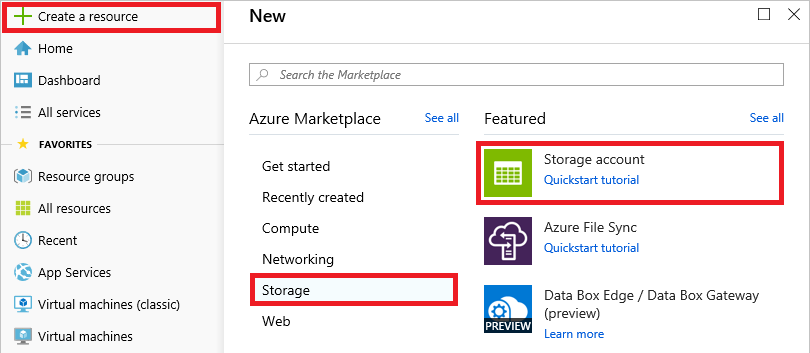
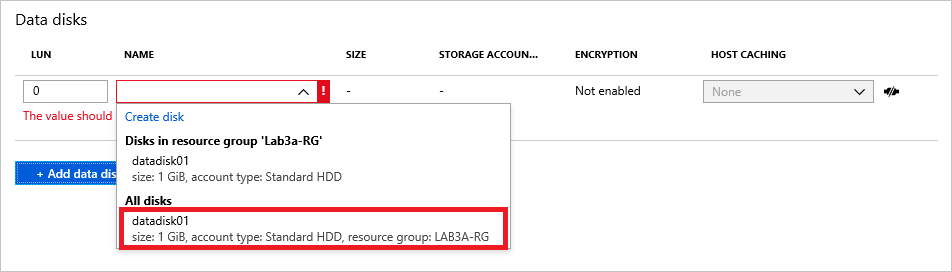

# Module 3: Integrating with Azure Compute Services

### Lab A: Uploading an on-premises virtual disk file to Azure

In this lab, you will create an Azure storage account and upload a .vhd file containing a virtual hard disk to the account. Then you will convert the virtual hard disk into a managed data disk and attach it to a virtual machine. 

```
Perform the exercises in this lab in the Windows Server 2016 VM that you created in Module 1, Lab A.
```

## Exercise 1 - Prepare a virtual disk file for Azure

In this exercise, you will use the Azure portal to create a storage account. Storage accounts can hold blobs, tables, queues, and files, and are one of the primary mechanisms used to store data in Azure.

### Task 1: Create an Azure storage account

1. Navigate to the Azure portal at https://portal.azure.com. If prompted, sign in using the Microsoft account that is the Service Administrator of your Azure subscription.

1. Click **+ Create a resource** in the menu of the left side of the page. Then click **Storage**, followed by **Storage account**.

	

1. Specify the following settings for the storage account:

	- Subscription: Select your subscription
	- Resource group: Create a new resource group named **Lab3a-RG**
	- Storage account name: Enter a unique name from 3 to 24 characters in length consisting only of numbers and lowercase letters
	- Location: **East US**
	- Performance: **Standard**
	- Account kind: **StorageV2 (general purpose v2)**
	- Replication: **Locally-redundant storage (LRS)**

7.  Now click **Next : Advanced >** at the bottom of the blade and enter the following settings:

	- Secure transfer required: **Disabled**
	- Virtual Networks: **All networks**
	- Data Lake Storage Gen2: **Disabled**

8.  Click **Review + create** at the bottom of the blade. Then click **Create** once the settings are validated.

Do not wait until the storage account is created, but proceed to the next task.

### Task 2: Create a VHD virtual disk

1. Launch PowerShell **as an administrator**.

2. Execute the following two commands in the PowerShell console to create a folder named "Test" and the "$diskName" variable:

	```powershell
	Mkdir c:\Test
	$diskName = 'datadisk01'

	```
	
3. In the VM in which you're working, right-click the **Start** button and select **Computer Management** to launch the Computer Management console.

4. In the Computer Management console, click **Disk Management** in the treeview on the left.

5. Select **Create VHD** from the **Action** menu.

6. Specify the following settings in the ensuing dialog and click **OK**:

	- Location: **C:\Test\datadisk01.vhd**
	- Virtual hard disk size: **1 GB**
	- Virtual hard disk format: **VHD**
	- Virtual hard disk type: **Dynamically expanding**

	
7. Right-click the newly created disk and select **Detach VHD**. The click **OK** in the ensuing dialog.

8. Close the Computer Management console.


## Exercise 2 - Upload a virtual disk file to Azure

In this exercise, you will upload the VHD file that you created in the previous exercise to Azure storage and convert it into a managed disk. Then you will create a Linux virtual machine and attach the managed disk to it.

### Task 1: Upload the VHD to the Azure storage account

1. Execute the following command in the PowerShell console. When prompted, provide the user name and password for your Microsoft account:

	```powershell
	Add-AzureRmAccount
	```

1. Use the following command to list the Azure subscriptions associated with your Microsoft account:

	```powershell
	Get-AzureRmSubscription
	```

1. If more than one subscription is listed, pick the one that you used to create the storage account in Exercise 1 and use the following command to make it the default subscription, replacing `<SubscriptionName>` with the name of the subscription:

	```powershell
    Select-AzureRmSubscription -SubscriptionName '<SubscriptionName>'
	```

1. Execute the following commands in the PowerShell console to upload the VHD to Azure:

	```powershell
	$storageAccount = Get-AzureRmStorageAccount -ResourceGroupName 'Lab3a-RG'
	Add-AzureRmVhd -ResourceGroupName $storageAccount.ResourceGroupName -Destination "$($storageAccount.PrimaryEndpoints.Blob)vhds/$diskName.vhd" -LocalFilePath "C:\Test\$diskName.vhd"
	```

Because the `Add-AzureRmVhd` cmdlet copies only the content of the VHD file that is in use, the upload should only take a few seconds. In addition, the cmdlet automatically converts the dynamically expanding disk into fixed format. If the command fails with the error message "The pipeline was not run because a pipeline is already running," wait a few moments and try again.

### Task 2: Convert the uploaded VHD into a managed data disk

1. Execute the following PowerShell command to define the managed disk configuration, and ignore any warnings about upcoming breaking changes:

	```powershell
	$diskConfig = New-AzureRmDiskConfig -AccountType 'Standard_LRS' -Location $storageAccount.Location -CreateOption Import -StorageAccountId $storageAccount.id -SourceUri "$($storageAccount.PrimaryEndpoints.Blob)vhds/$diskName.vhd"
	```

1. Now use this command to convert the VHD file into a managed disk. Once more, ignore any warnings about breaking changes:

	```powershell
	New-AzureRmDisk -Disk $diskConfig -ResourceGroupName $storageAccount.ResourceGroupName -DiskName $diskName
	```

1. Wait for the conversion to complete. It should take about one minute. Confirm that `ProvisioningState : Succeeded` appears in the output indcating that the conversion was successful.

### Task 3: Provision an Azure VM

1. Click **+ Create a resource** in the Azure portal. Then click **Compute**, followed by **Ubuntu Server 18.04 LTS**.

1. Enter the following settings, and then click **Next : Disks >**:

	- Subscription: Select the same subscription you used to create the storage account in Exercise 1
	- Resource group: **Lab3a-RG**
	- Name: **Lab3a-vm4**
	- Region: Select the same region you selected for the storage account in Exercise 1
	- Size: Click **Change size** and select **B1s**
	- Authentication type: **Password**
	- User name: **Student**
	- Password: **Pa55w.rd1234**
	- Confirm password: **Pa55w.rd1234**
	- Login with Azure Active Directory: **Off**
	- Public inbound ports: **None**

1. In the "Disks" tab, you have the option of attaching a disk. (Note the links under DATA DISKS.) You won't use this option here because it's useful to know how to attach managed disks after a VM is created.

1. Click the **Next : Networking >** button. Then click **Next : Management >** to go to the "Management" tab. Enter the following settings:

	- Boot diagnostics: **Off**
	- Guest OS diagnostics: **Off**
	- System assigned managed identity: **Off**
	- Auto-Shutdown: **Off**
	- Backup: **Off**

1. Click **Review + create** at the bottom of the blade. Wait for the settings to be validated, and then click **Create**.

Wait for the virtual machine to be deployed before proceeding. Deployment should only take a few minutes.

### Task 4: Attach the managed data disk to the VM

1. Open the **Lab3a-RG** resource group in the Azure portal.

1. Click **Lab3a-vm4**. Then click **Disks** in the menu on the left side of the blade.

1. Click **+ Add data disk**. Select **datadisk01** from the list of data-disk names. Then click **Save** at the top of the blade.

	

1. Wait until the disk is successfully attached to the Azure VM.

### Task 5: Delete the resource group

Finish up by deleting the **Lab3a-RG** resource group using the same procedure you used to delete resource groups in previous labs. You won't be using these resources again, so there is no need to keep them around and incur unnecessary charges to your Azure subscription.
