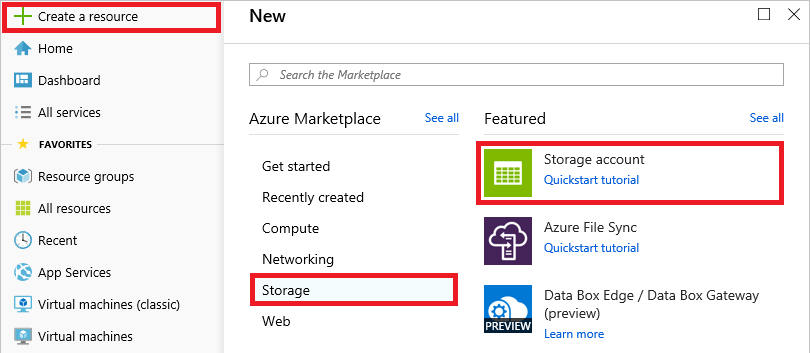
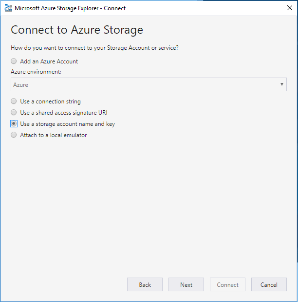
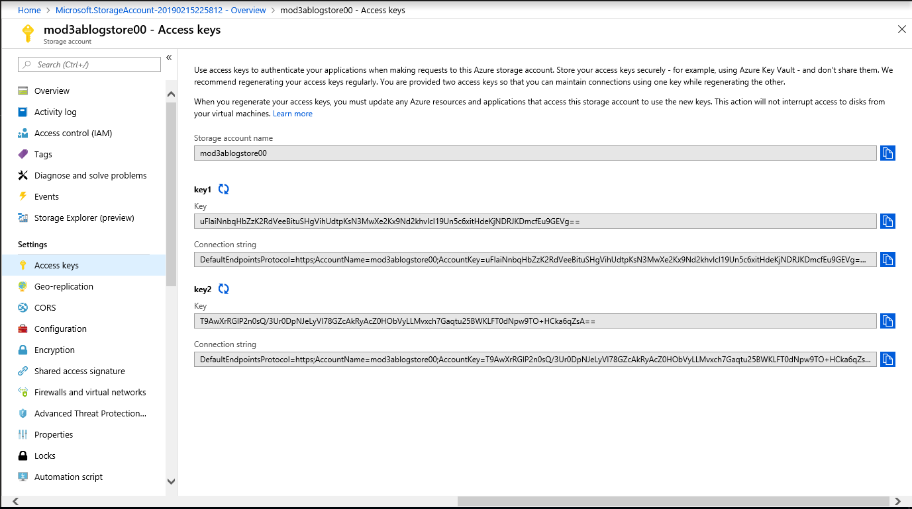
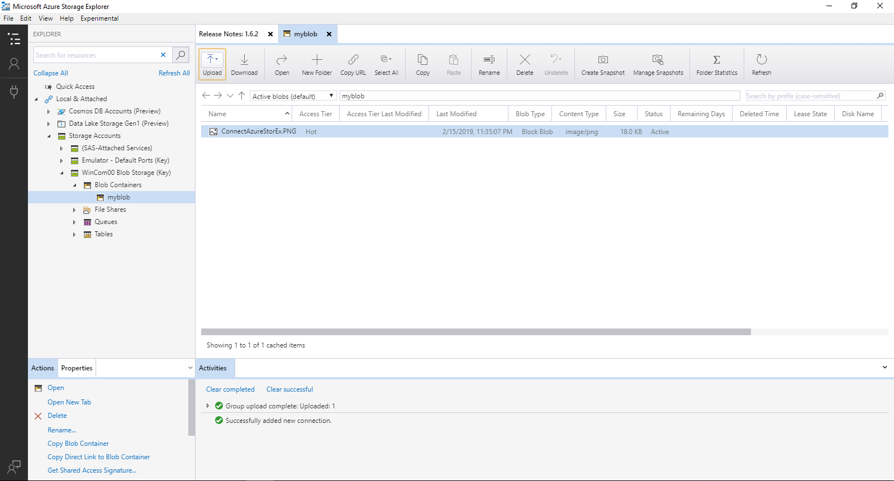
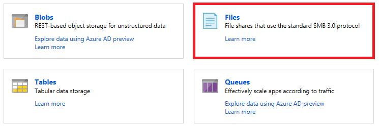
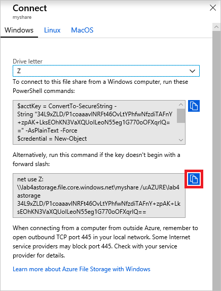

# Module 4: Azure Storage types and capabilities

### Lab A: Mount an Azure file share as a network drive

In this lab, you will create an Azure storage account and create a file share inside it. Then you will mount the file share as a network drive in your Azure VM.

```
Perform the exercises in this lab in the Windows Server 2016 VM that you created in Module 1, Lab A.
```

## Exercise 1 - Create a Genral Purpose File and Blob storage account

In this exercise, you will create an two Azure storage accounts. Storage accounts can hold blobs, tables, queues, and files, and are one of the primary mechanisms used to store data in Azure.

1. Navigate to the Azure portal at https://portal.azure.com. If prompted, sign in using the Microsoft account that is the Service Administrator of your Azure subscription.

1. Click **+ Create a resource** in the menu of the left side of the page. Then click **Storage**, followed by **Storage account**.

	

1. Specify the following settings for the storage account:

	- Subscription: Select your subscription
	- Resource group: Create a new resource group named **Lab4a-RG**
	- Storage account name: **lab4afilestoreXX** (for XX, use your student number, assigned by the instructor). 
	- Location: **East US**
	- Performance: **Standard**
	- Account kind: **StorageV2 (general purpose v2)**
	- Replication: **Locally-redundant storage (LRS)**
	- Access tier: **Hot**

1. Click **Review + create** at the bottom of the blade. Then click **Create** once the settings are validated.

1. Wait for the storage account to be created.

1. Repeat the steps but create a blob storage account as follows

	- Subscription: Select your subscription
	- Resource group:  **Lab4a-RG**
	- Storage account name: **lab4ablobstoreXX**
	- Location: **East US**
	- Performance: **Standard**
	- Account kind: **BlobStorage**
	- Replication: **Locally-redundant storage (LRS)**
	- Access tier: **Hot**

1. Click **Review + create** at the bottom of the blade. Then click **Create** once the settings are validated.

1. Wait for the storage account to be created.

##Exercise 3:  Install Storage Explorer

In this exercise you will download and install the Azure Storage Explorer program from Microsoft, and then map the Account keys 
from the storage accounts to Azure Storage Explorer, so you can use the local program to manage files.

##Task 1:  Download and install Azure Storage Explorer

1.	In the browser, open a new tab and type in the following URL:  https://azure.microsoft.com/en-us/features/storage-explorer/

2.	Double click the large blue button that says Download Storage Explorer free.

3.	At the bottom of the screen, right above the Taskbar, click Save and when finished downloading click **Run**.

4.	Click **Yes** in the User Account Control window.

5.	In the License Agreement page select the **I accept the agreement**, and then click **Install**.

6.	In the Select Destination Location page, click Next.

7.	In the Select Start Menu Folder page, click Next.

8.	When the setup is complete, click Finish.

##Task 2:  Configure the Storage Explorer

1.	Storage Explorer should run automatically when you click Finish. If it does not, go to the Start menu and you should find it at the top of the list under the Recently added group. Double-click it.



2.	Note the upper left quadrant of the Storage Explorer screen. There is a console tree of the most use items. Select and right-click the **Storage Accounts** node. In the context menu, click **Connect to Azure storage**.

3.	In the Connect to Azure storage page, in the Add an Azure Account drop-down, select Azure, and then select the **Use a storage account name and key** radio button.

4.	Return to the Azure portal.

5.	In the Hub menu, click Storage accounts. In the Storage accounts blade, double-click the storage account that is BlobStorage in the Kind column.

6.	In the lab4ablogstoreXX blade, in the console tree, click **Access keys**. You should note at least two keys available for the account. Note the blue square Copy button to the right of each item.



7.	Click the Copy button next to the Storage account name entry. Return to the Connect to Azure storage page you left in step three.

8.	In the Display name, type **WinComXX Blob Storage**.

9.	Click in the **Account name** text box, and on the keyboard, press Ctrl-V.

10.	Return to the Azure Portal, and in the Key 1 area, click the Copy button beside the Key value.

11.	Return to Storage Explorer, and click in the **Account Key** text box, and on the keyboard, press Ctrl-V.

12.	in the Azure Environment pulldown, select **Azure**, and then click Next.

13.	In the Connection Summary page, click **Connect**.

14.	The console tree of the Storage Explorer should now have a node for WinComXX Blob Storage (Key). Expand and then select Blob Containers.

15.	In the Actions and Properties quadrant below the console tree, in the Actions tab, click the **Create Blob** container. In the console tree, type **myblob**, and press Enter.

16.	In the upper-right details quadrant, you’ll see a new entry named myblob with a menu bar with a number of actions on it, as well as other controls.

17.	In the menu bar, click the Upload action and then select **Upload Files**.

18.	In the Upload files page, in the Files area, click the three ellipses (…).

19.	In the Select folder to upload window, navigate to the location where you had previously saved any file (the course Labfiles are great for this). Select the file and then click **Open**. Now in the Upload files page, click **Upload**.

20.	After a moment, the selected file should appear in the myblob quadrant.

21.	Return to the Azure portal.

22.	In the lab4ablogstoreXX blade, in the console tree, click **Blobs**.

23.	In the lab4ablogstoreXX – Blobs blade, in the console tree, click **myblob**.

24.	You should see your uploaded file. Double-click the file name and explore the various items and methods you can use for that particular file. If you selected a Word document, and click the Edit blob tab, you’ll see that the file does not render correctly but this is normal.



25.  **Optional**  You can repeat the above steps to add the **lab4afilestoreXX** storage account to Azure Storage Explorer.

## Exercise 3 - Create a file share and map a network drive to it

In this exercise, you will create a file share in the storage account you created in Exercise 1 and mount it as a network drive.

1. Open the **Lab4a-RG** resource group in the Azure portal.

1. Click the storage account that you created in Exercise 1. Then click **Files**.

	

1. Click **+ File share** at the top of the blade.

1. Name the file share "myshare," and set Quota to 1 GiB. Then click the **Create** button.

1. Click **myshare** to open the file share. Then click **Connect** at the top of the blade.

1. Click the **Copy** button next to the `net use` command to copy the command for connecting to the file share to the clipboard.

	

1. Launch a Command Prompt window and paste the command on the clipboard into the window. Then execute the command.

1. Use a `copy` command to copy some files to the root directory of drive Z:

1. Use the following command to list the contents of the Z: drive's root directory:

	```
	dir z:\
	```

	Confirm that the files you copied are there.

1. Return to the file share in the Azure portal. Click **Refresh** at the top of the blade. Confirm that the files you copied to drive Z: appear in the list of files.

Mounting an Azure file share as a network drive frequently doesn't work on local computers. It requires port 445 to be open to outbound TCP traffic, and even if you open the port, it is often blocked by Internet service providers. However, port 445 is open to Azure file shares in Azure VMs.

## Exercise 3 - Delete the resource group

Finish up by deleting the **Lab4a-RG** resource group using the same procedure you used to delete resource groups in previous labs. You won't be using these resources again, so there is no need to keep them around and incur unnecessary charges to your Azure subscription.
