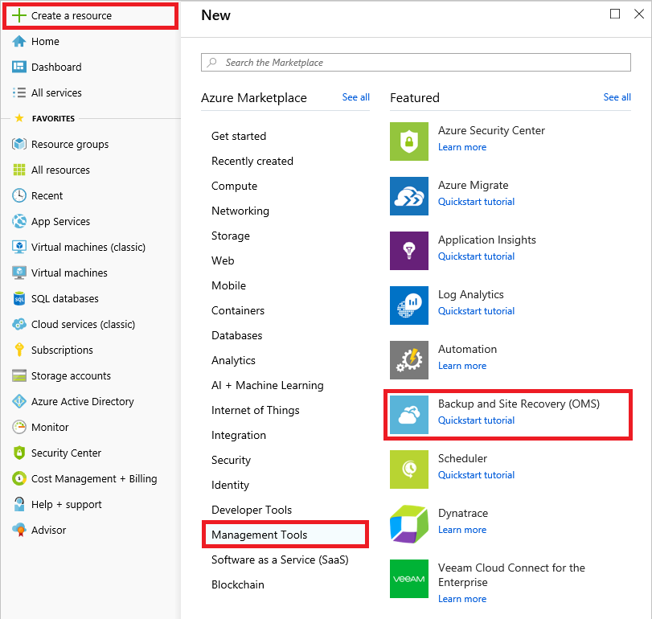
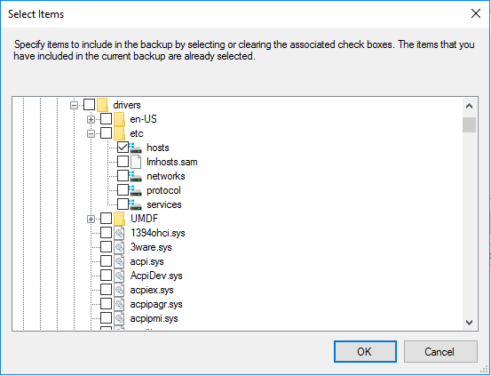
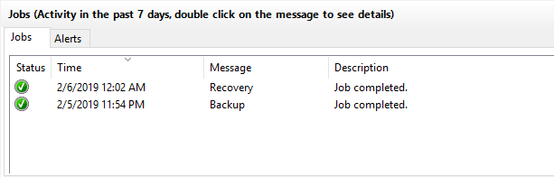

# Module 4: Azure Storage types and capabilities

### Lab B: Implementing Azure Recovery Services agent-based backups

Every enterprise needs a plan for business continuity and disaster recovery (BCDR) in the event that systems go offline or are damaged beyond repair. [Azure Site Recovery](https://azure.microsoft.com/services/site-recovery/) fills this need by offering a Backup service for replicating mission-critical data in the cloud, and a Site Recovery service for replicating workloads on physical and virtual machines to secondary locations and failing over to those locations when the primary location suffers an outage.

In this lab, you will configure Azure's Backup and Site Recovery service to back up a portion of the file system in your lab VM.

```
Perform the exercises in this lab in the Windows Server 2016 VM that you created in Module 1, Lab A.
```

## Exercise 1 - Create a recovery vault

In this exercise, you will use the Azure portal to create a backup and recovery vault.

1. Navigate to the Azure portal at https://portal.azure.com. If prompted, sign in using the Microsoft account that is the Service Administrator of your Azure subscription.

1. Click **+ Create a resource** in the menu of the left side of the page. Then click **Management Tools**, followed by **Backup and Site Recovery (OMS)**.

	

1. Enter the following settings, and then click **Create**:

	- Name: **RSlab4b-vault**
	- Subscription: Select your subscription
	- Resource group: Create a new resource group named **RSlab4b-RG**
	- Location: Select any Azure region where you can create a recovery services vault, preferably close to the lab location

1. Wait for the vault to be provisioned.

## Exercise 2 - Configure your computer for agent-based backups

In this exercise, you will configure the virtual machine in which you are working this lab for agent-based backups.

### Task 1: Install the Azure Recovery Services agent

1. In the Azure portal, open the **RSlab4b-RG** resource group. Then click **RSlab4b-vault**.

1. Click **+ Backup** at the top of the blade.

1. Under "Where is your workload running?", select **On-Premises**. In the drop-down labeled "What do you want to backup?", check the **Files and folders** box. Then click **Prepare Infrastructure**.

1. Click **Download Agent for Windows Server or Windows Client** and run the file to launch the Microsoft Azure Recovery Services Agent Setup Wizard.

1. On the "Installation Settings" page, accept the default settings and click **Next**.

1. On the "Proxy Configuration" page, accept the default settings and click **Next**.

1. On the "Microsoft Update Opt-in" page, select **I do not want to use Microsoft Update**. Then click **Next**.

1. Click **Install** to begin the installation.

1. Wait for the installation to complete. Then click **Proceed to Registration**. This will launch the Register Server wizard.

### Task 2: Register the vault with Recovery Services agent

1. Return to the Azure portal. In the "Prepare infrastructure" blade, check the box labeled "Already downloaded or using the latest Recovery Services Agent." Then click the **Download** button and save the downloaded file.

1. Switch back to the Register Server wizard. Click the **Browse** button and open the **.VaultCredentials** file downloaded in the previous step.

1. Wait for credential validation to complete, and then click **Next**.

1. Click **Generate Passphrase**. Then click the **Browse** button and select the folder where you want to store the passphrase.

1. Wait for registration to complete. Make sure **Launch Microsoft Azure Recovery Services Agent** is checked, and then click **Close**. This will open the Microsoft Azure Backup window.

### Task 3: Configure throttling options

1. Click **Change Properties** in the Actions pane of the Microsoft Azure Backup window.

1. Go to the "Throttling" tab. Check the box labeled "Enable internet bandwidth usage throttling for backup operations" and click **OK**. Then click **OK** in the message box.

	> Note that you have the option of adjusting the bandwidth and the definition of what constitutes work and non-work hours.

## Exercise 3 - Perform a backup and restore

In this exercise, you will test what you have done so far by performing a manual backup and restore.

### Task 1: Configure a backup schedule

1. Click **Schedule Backup** in the Actions pane of the Microsoft Azure Backup window to launch the Schedule Backup wizard.

1. Click **Next**. Then click **Add Items**.

1. Navigate to the "C:\Windows\System32\drivers\\etc" folder and the check the **hosts** box. Make sure this is the only item selected, and then click **OK**.

	

1. Click **Next**. Change the entry in the first drop-down list to **11:00 PM**, and then click **Next**.

1. Click **Next** again. Make sure "Automatically over the network" is selected, and then click **Next**.

1. Click **Finish**. Then click **Close** to close the wizard.

### Task 2: Perform a manual backup

1. Click **Back Up Now** in the Microsoft Azure Backup window to launch the Back Up Now wizard.

1. Click **Next**. Then click **Back Up**. Notice that you can change the server settings, but not the list of backup items.

1. Wait for the backup to complete. Then click **Close**.

### Task 3: Perform a restore

1. Click **Recover Data** in the Actions pane of the Microsoft Azure Backup window to launch the Recover Data wizard.

1. Make sure **This server** is selected on the "Getting Started" page. Then click **Next**.

1. Make sure **Individual files and folders** is selected on the "Select Recovery Mode" page. Then click **Next**.

1. Select **C:\** from the drop-down list and click **Mount**. Since there is only one backup, the date of the backup is automatically selected.

1. Once the backup is mounted, click **Browse** to open a File Explorer window.

1. In the File Explorer window, navigate to "Windows\System32\drivers\etc." Right-click the **hosts** file and click **Copy** in the context menu. Then paste the file into the "Documents" folder.

1. Switch back to the Recover Data wizard and click **Unmount**. When prompted for confirmation, click **Yes.** 

1. In the Microsoft Azure Backup window, verify that the recovery is marked as job completed.

	

## Exercise 4 - Delete the resources created in this lab

In this exercise, you will delete all the resources created during the course of this lab.

1. Return to the Azure portal and open the **RSlab4b-RG** resource group. Click **RSlab4b-vault**.

1. Click **Backup Infrastructure** in the menu on the left side of the blade.

1. Click **Protected Servers** in the menu on the left side of the next blade. Then click **Azure Backup Agent**.

1. Click your server (MAIN-LAB-VM1). Then click **Delete** at the top of the blade. Type the server name and click **Delete** again. *Be sure to include the trailing period in the server name*, or else the **Delete** button will remain disabled.

1. Return to the "RSlab4b-vault" blade and click **Delete** at the top of the blade. When prompted for confirmation, click **Yes**.

1. Click **Resource groups** in the menu on the left side of the portal.

1. Find the resource group named **RSlab4b-RG**. Click the ellipsis (the three dots) on the right end of the row and select **Delete resource group** from the ensuing menu.

1. Type the resource-group name into the box labeled TYPE THE RESOURCE GROUP NAME. Then click the **Delete** button at the bottom of the blade.
