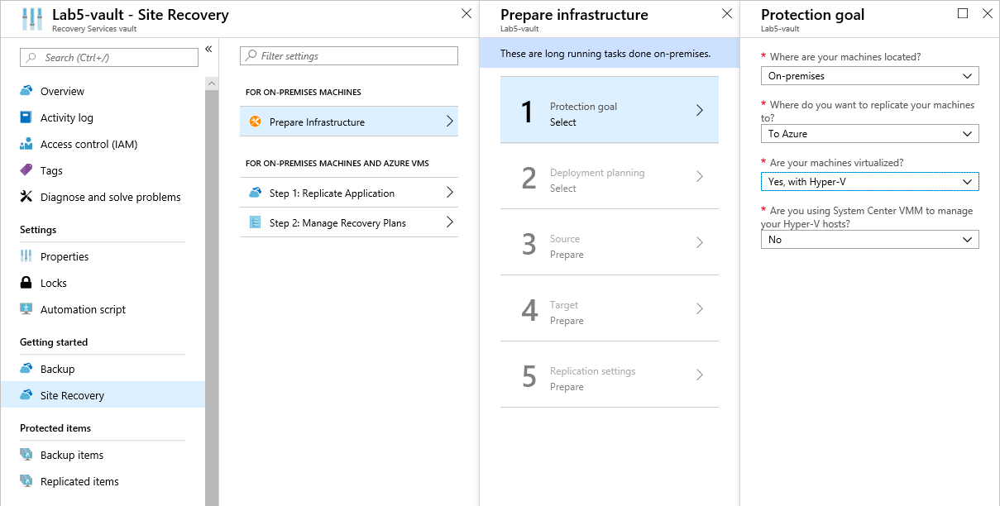
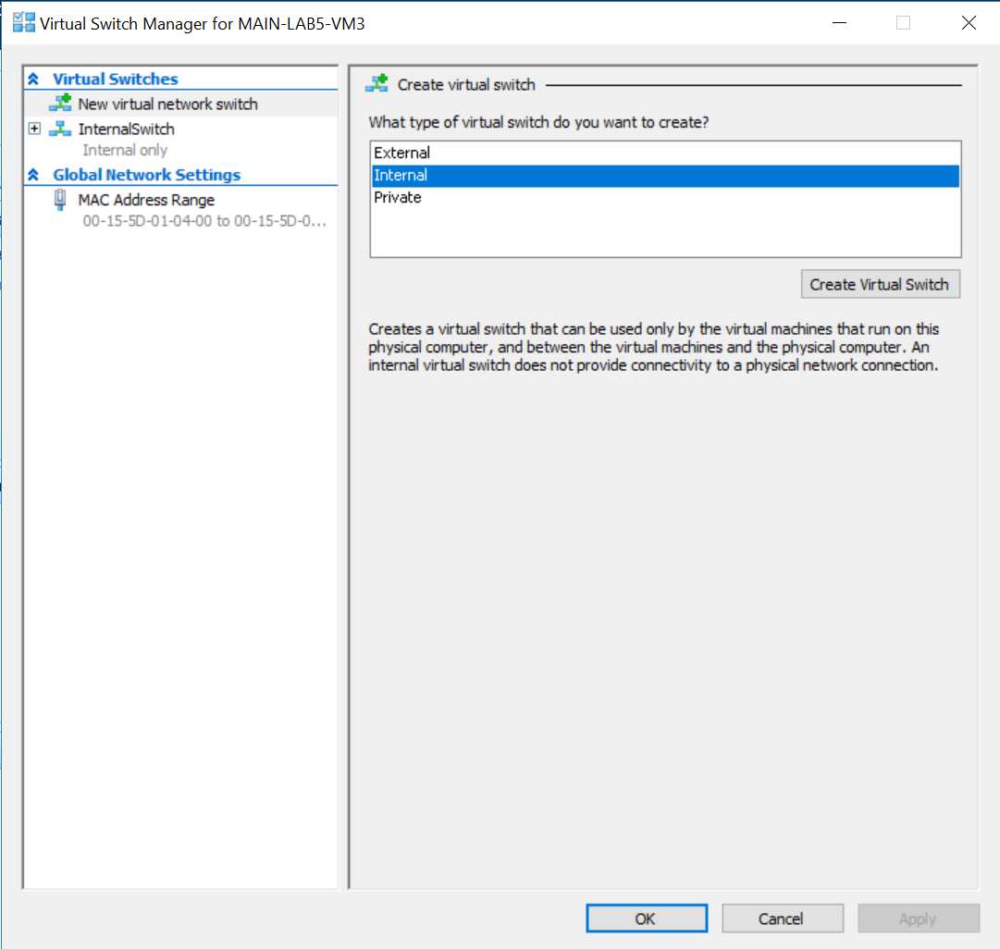
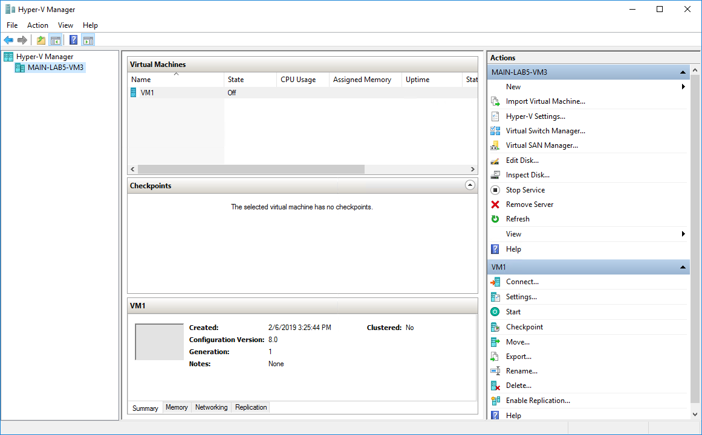
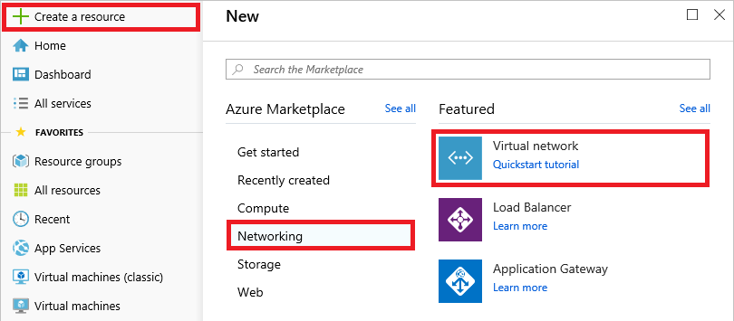
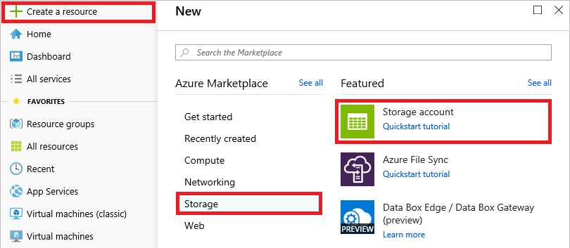
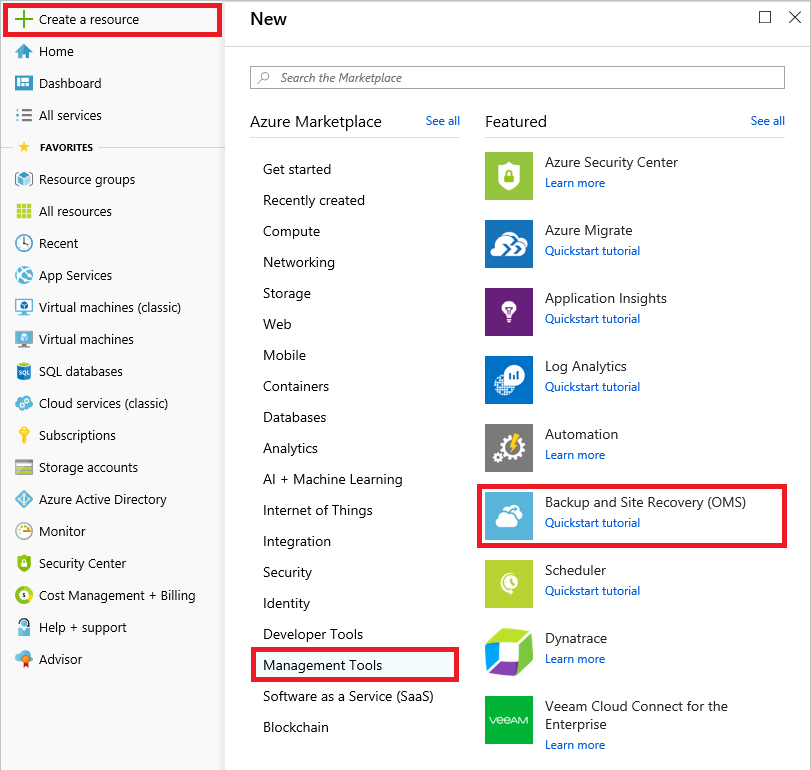
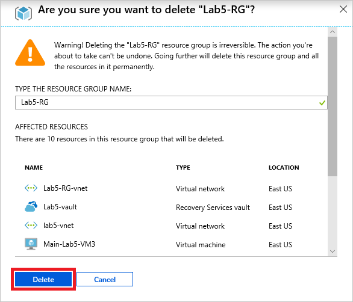

# Module 5: Designing and implementing Azure Site Recovery solutions

### Lab: Protecting on-premises Hyper-V virtual machines using Azure Site Recovery

Every enterprise needs a plan for business continuity and disaster recovery (BCDR) in the event that systems go offline or are damaged beyond repair. [Azure Site Recovery](https://azure.microsoft.com/services/site-recovery/) fills this need by offering a Backup service for replicating mission-critical data in the cloud, and a Site Recovery service for replicating workloads on physical and virtual machines to secondary locations and failing over to those locations when the primary location suffers an outage.

In this lab, you will use the Azure Site Recovery service to implement a site-recovery solution for a workload hosted in a Hyper-V virtual machine.



## Exercise 1 - Create a VM that supports nested virtualization

For this lab, you will use a more powerful VM than the one you used in previous labs. The new VM has four virtual CPUs, 16 GB of RAM, and a 32 GB SSD drive. It also supports [nested virtualization](https://azure.microsoft.com/blog/nested-virtualization-in-azure/), which is essential for the exercises in the lab. In this exercise, you will create that VM, and then create a Hyper-V virtual machine inside it.

### Task 1, Install VM with Nested Virtualization


1. Using the steps outlined in Module 1, Lab A, create a new Windows Server 2016 virtual machine named **Main-Lab5-VM3** with the following changes:

	- Place the VM in a new resource group named **Lab5-RG**
	- Set the VM size to **D4s v3**

	Don't forget to enable RDP on the VM, too. Otherwise, you won't be able to remote in.

2. Once the VM is deployed, remote into it, start PowerShell **as an administrator**, and execute the following commands in the PowerShell console:

	```powershell
	Set-ExecutionPolicy -ExecutionPolicy Unrestricted
	Install-WindowsFeature Hyper-V,Hyper-V-Tools,Hyper-V-PowerShell
	```

3. Now use this command to restart the virtual machine:

	```powershell
	Restart-Computer
	```

4. Reconnect to the virtual machine. Click the Windows **Start** button. Then click **Windows Administrative Tools**, and underneath that, click **Hyper-V Manager** to launch the Windows Hyper-V Manager.

5. In the Hyper-V Manager console, click the machine name (MAIN-LAB5-VM3) in the treeview on the left and in the **Actions** pane on the right, click **Virtual Switch Manager**.  In the Virtual Switch Manager window, select **Internal** and then click the **Create Virtual Switch** button.  In the second window, in the **Name** field, type **InternalSwitch** and then click **OK**.



6.  Right-click the machine name (MAIN-LAB5-VM3) again and select **New -> Virtual Machine...** to launch the New Virtual Machine wizard.

7. Click **Next**. In the "Specify Name and Location" page, name the virtual machine **VM1**, and then click **Next**.

8. Accept the defaults on all other pages except the **Configure Networking** page, where you will change the **No Connection** dropdown and select **InternalSwitch**. Then click **Finish** on the Summary page.

9. Confirm that VM1 appears in the list of virtual machines hosted on MAIN-LAB5-VM3.

	

10. Close the Hyper-V Manager console.


As a reminder, you should use Server Manager to disable IE's enhanced security configuration for administrators, too. It makes using the Azure portal in the VM much easier.

## Exercise 2 - Prepare your environment for Site Recovery

In this exercise, you will create an Azure virtual network, a storage account, and a Recovery services vault — all part of the infrastructure necessary to leverage Azure Site Recovery.

### Task 1: Create an Azure virtual network

1. In the Azure VM that you created in the previous exercise, navigate to the Azure portal at https://portal.azure.com. If prompted, sign in using the Microsoft account that is the Service Administrator of your Azure subscription.

1. Click **+ Create a resource** in the menu of the left side of the page. Then click **Networking**, followed by **Virtual Network**.

	

1. Enter the following settings into the "Create virtual network" blade, and then click **Create**:

	- Name: **lab5-vnet**
	- Address space: **10.5.0.0/20**
	- Subscription: Select your subscription
	- Resource group: **Lab5-RG**
	- Location: **East US**
	- Subnet name: **subnet-0**
	- Subnet address range: **10.5.0.0/24**
	- DDoS Protection: **Basic**
	- Service endpoints: **Disabled**
	- Firewall: **Disabled**

1. Do not wait until the virtual network is provisioned. Instead, proceed directly to the next task.

### Task 2: Create an Azure storage account

1. Click **+ Create a resource** in the menu of the left side of the Azure portal. Then click **Storage**, followed by **Storage account**.

	

1. Specify the following settings for the storage account:

	- Subscription: Select the same subscription you used in the previous task
	- Resource group: **Lab5-RG**
	- Storage account name: Enter a unique name from 3 to 24 characters in length consisting only of numbers and lowercase letters
	- Location: **East US**
	- Performance: **Standard**
	- Account kind: **Storage (general purpose v1)**
	- Replication: **Locally-redundant storage (LRS)**

	It is important to choose **general purpose v1** (not **general purpose v2**) as the storage-account type because Azure Site Recovery currently does not support v2 storage accounts.

1. Click **Review + create** at the bottom of the blade. Then click **Create** once the settings are validated.

1. Do not wait until the storage account is provisioned. Instead, proceed directly to the next task.

### Task 3: Create an Azure Recovery Services vault

1. Click **+ Create a resource** in the menu of the left side of the Azure portal. Then click **Management Tools**, followed by **Backup and Site Recovery (OMS)**.

	

1. Enter the following settings, and then click **Create**:

	- Name: **Lab5-vault**
	- Subscription: Select the same subscription you used in the previous task
	- Resource group: **Lab5-RG**
	- Location: **East US**

1. Wait for the vault to be provisioned before proceeding to the next task.

Upon completion of this exercise, you have successfully created an Azure virtual network, an Azure storage account, and a Recovery Services vault. Now let's configure the host and the vault.

## Exercise 3 - Configure a Hyper-V host for site recovery

In this exercise, you will configure the VM1 virtual machine for site recovery. This will involve configuring the Recovery Services vault that you created in the previous exercise, registering the Hyper-V host and the VM for replication and recovery, creating a replication policy, and creating a recovery plan.

### Task 1: Configure the Recovery Services vault

1. Open the **Lab-RG** resource group in the portal and click **Lab5-vault**.

1. Click **Site Recovery** in the menu on the left side of the blade. Then click **Prepare Infrastructure**.

1. In the "Protection goal" blade, specify the following settings. Then click **OK**.

	- Where are your virtual machines located? **On-premises**
	- Where do you want to replicate your machines to? **To Azure**
	- Are your machines virtualized? **Yes, with Hyper-V**
	- Are you using System Center VMM to manage your Hyper-V hosts? **No**

	**Main-Lab5-VM3** is an Azure virtual machine, but for the purpose of this lab, we will treat it as if it were on-premises.

1. In the "Deployment planning" blade, select **Yes, I have done it** from the drop-down list asking if you have completed deployment planning. Then click **OK**.

1. Click **+ Hyper-V Site** at the top of the "Prepare source" blade. Name the site **Lab5-Site**, and then click **OK**.

1. Click **+ Hyper-V Server** at the top of the "Prepare source" blade. In the "Add Server" blade, review the list of steps required to add a Hyper-V server. Click the **Download** link in Step 3 (not the **Download** button in Step 4) and run the downloaded file (**AzureSiteRecoveryProvider.exe**) to launch the setup wizard.

1. Select **Off** on the first page to turn off Microsoft Update. Click **Next**, and then click **Install**.

1. Wait for the installation to complete, and then click **Register**. This will launch the Microsoft Azure Site Recovery Registration wizard.

### Task 2: Register the Hyper-V host with the Recovery Services vault

1. Switch back to the "Add Server" blade in the Azure portal and click the **Download** button in Step 4. Save the downloaded **.VaultCredentials** file to the "Downloads" folder.

1. Switch back to the Microsoft Azure Site Recovery Registration wizard and click the **Browse** button. Navigate to the "Downloads" folder and select the **.VaultCredentials** file you downloaded in the previous step. Then click **Next**.

1. Accept the default proxy settings and click **Next**.

1. Wait until registration completes successfully, and then click **Finish**. Registration should take just a few minutes, but it might be 15 minutes or more before the Hyper-V server appears in the Azure portal.

1. Return to the Azure portal. Close the "Add Server" blade and the "Prepare source" blade. When warned that unsaved edits will be discarded, click **OK**.

1. Click **3 Source Prepare** in the "Prepare infrastructure" blade. Verify that **Main-Lab5-VM3** is listed under **Step 2: Ensure Hyper-V servers are added**, and then click **OK**. If **Main-Lab5-VM3** doesn't appear in the list, close the blade, wait a few minutes, and then try again.

1. In the "Target" blade, confirm that **Resource Manager** is selected as the deployment model, and that green check marks appear in Steps 1, 2, and 3. Then click **OK** at the bottom of the blade.

### Task 3: Create a Site Recovery replication policy

1. Click **+ Create and Associate** at the top of the "Replication policy" blade.

1. Enter the following settings in "Create and associate policy" blade, and then click **OK**:

	- Name: **Lab5-ASRPolicy**
	- Source type: **Hyper-V**
	- Target type: **Azure**
	- Copy frequency: **5 minutes**
	- Recovery point retention in hours: **2**
	- App-consistent snapshot frequency in hours: **1**
	- Initial replication start time: Choose a time 12 hours ahead of the current time
	- Associated Hyper-V site: **Lab5-Site**.

1. Wait for the replication policy to be created and associated with **Lab5-Site**. After both steps complete successfully, click **OK**.

1. Click **OK** at the bottom of the "Prepare infrastructure" blade.

### Task 4: Configure virtual machine replication

1. Click **Step 1: Replicate Application** in the "Site Recovery" blade.

1. In the "Source" blade, ensure that "Source" is to set **On-premises** and "Source location" is set to **Lab5-Site**. Then click **OK**.

1. In the "Target" blade, specify the following settings. Then click **OK** at the bottom of the blade: 

	- Target: **Azure**
	- Post-failover resource group: **Lab5-RG**
	- Post-failover deployment model: **Resource Manager**
	- Storage account: The storage account you created in Exercise 2
	- Azure network: **Configure now for selected machines**
	- Post-failover Azure network: **lab5-vnet**
	- Subnet: **subnet-0 (10.5.0.0/24)**

1. In the "Select virtual machines" blade, check the box next to **VM1**. Then click **OK**.

1. In the "Configure properties" blade, select **Windows** as the OS type in the "Defaults" row. Then click **OK**.

1. In the "Configure replication settings" blade, verify that **Lab5-ASRPolicy** is selected as the replication policy, and then click **OK**.

1. Click **Enable replication** at the bottom of the "Enable replication" blade.

### Task 5: Create a recovery plan

1. Click **Step 2: Manage Recovery Plans** in the "Site Recovery" blade.

1. Click **+ Recovery plan** at the top of the blade and enter the following settings:

	- Name: **Lab5-RecoveryPlan**
	- Source: **Lab5-Site**
	- Target: **Microsoft Azure**
	- Allow items with deployment model: **Resource Manager**
	- Select items: Check the box next to **VM1** and click **OK**

	Then click **OK** at the bottom of the "Create recovery plan" blade.

1. Wait for the recovery plan to be created and confirm that it appears in the list shown in the "Recovery plans" blade. Then close the blade.

##Optional Exercise - Failover VM1

##Task 1 Install Windows Server 2016 Core on VM1

1.  In the browser, navigate to:  https://www.microsoft.com/en-us/evalcenter/

2.  Scroll down and Click Windows Server, and then select Windows Server 2019

3.  Select ISO, and then Continue.  Fill out form as required, and then click Continue.

4.  Select your language, and then click Download.  Save to the Downloads directory.

5.  After the iso download finishes, in The Start menu, go to Administrative Tools, and then **Hyper-V Manager**.

6.  In Hyper-V Manager, double click VM1, and in the Media menu, select **DVD Drive**, and then **Insert Disk**.   In File Explorer, select the downloaded iso.  Now click 
the **Start** button on the VM1 Virtual Machine Connection window.

7.  Install Windows Server 2019 Core, using all defaults.  Use a Custom installation.

8.  When VM1 boots up after install, it will require you to create an administrator password.  Use **Pa55w.rd**

9.  Close the VM1 Machine Connection Window.

##Task 2 Failover VM1


## Exercise 4 - Delete Azure resources created in this lab

In this exercise, you will delete all the resources created during the course of this lab.

1. In the Azure portal, navigate to the **Lab5-vault** blade.

2. Click **Replicated items** in the menu on the left side of the blade.

3. Click the ellipsis to the right of **VM1** and select **Disable Replication**. Answer the ensuing questions about *why* you're disabling replication, and then click **OK** at the bottom of the blade.

4. Close the "Replicated items" blade and return to the "Lab5-vault" blade. Then click **Site Recovery Infrastructure** in the menu on the left side of the blade.

5. Click **Hyper-V Hosts** in the menu on the left side of the blade.

6. Click the ellipsis to the right of **Main-Lab5-VM3** and select **Delete**. When prompted for confirmation, click **OK**.

	> DO NOT disregard error messages indicating that **Deleting Hyper-V server** operation failed. Repeat until **Main-Lab5-VM3** is gone.

1. Return to the "Lab5-vault" blade and click **Overview** in the menu on the left side of the blade. Then click **Delete** at the top of the blade. When prompted for confirmation, click **Yes**.

7. Click **Resource groups** in the menu on the left side of the portal.

8. Find the resource group named **Lab5-RG**. Click the ellipsis on the right end of the row and select **Delete resource group** from the ensuing menu.

9. Type the resource-group name into the box labeled TYPE THE RESOURCE GROUP NAME. Then click the **Delete** button at the bottom of the blade.

	

