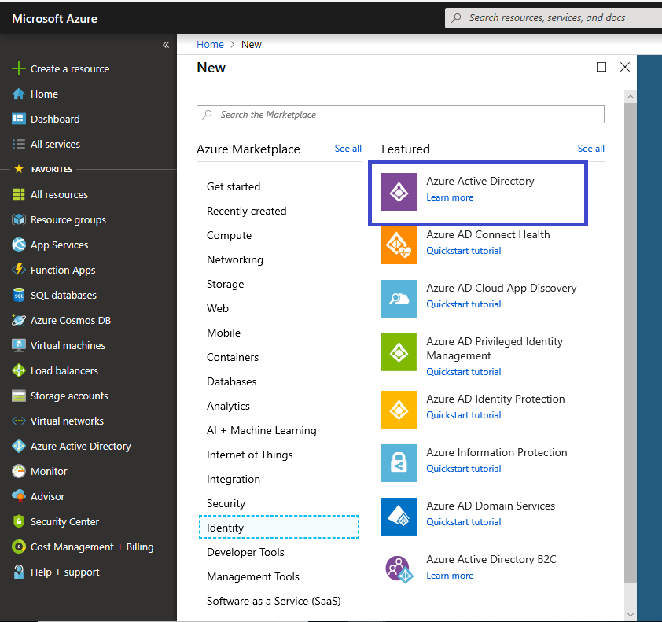
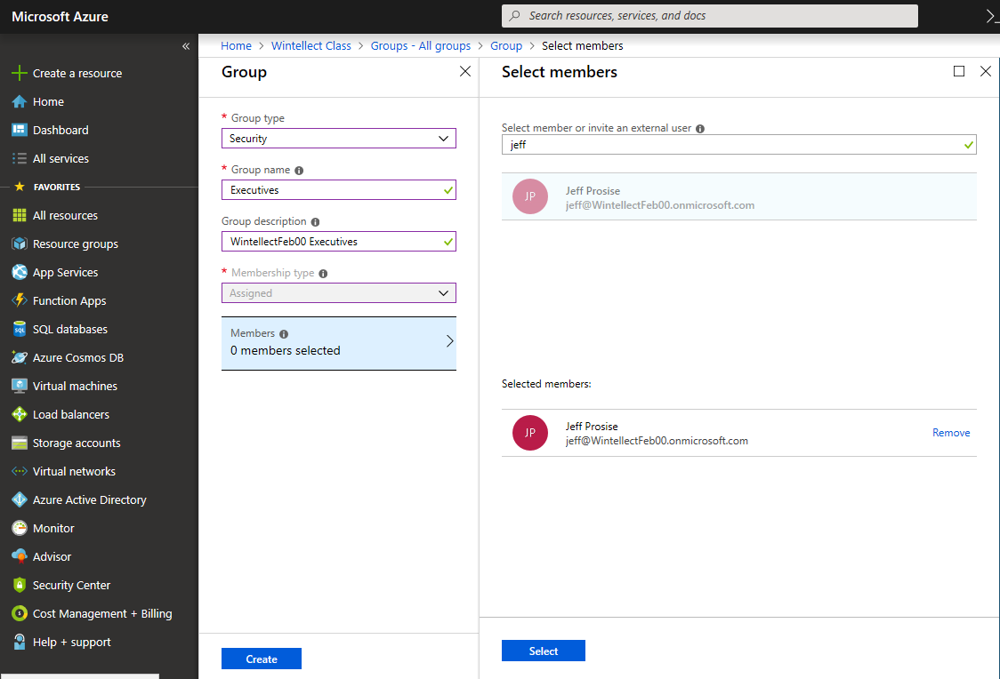
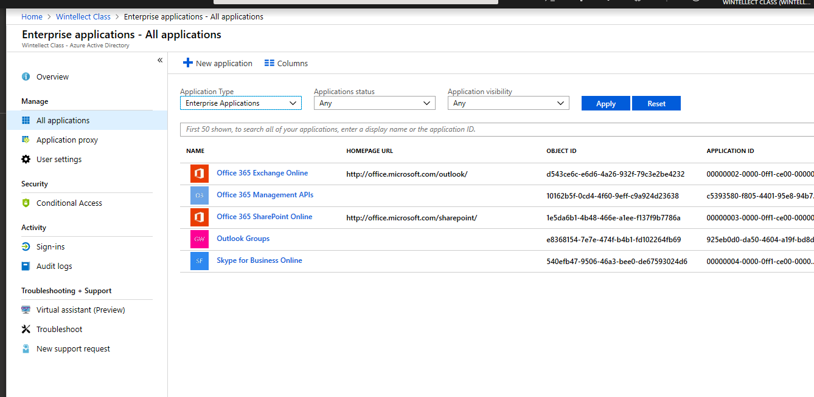

# Module 6: Implementing Azure Active Directory

### Lab: Implementing Azure Active Directory
In this lab, you will create an Azure Active Directory, and then populate it with user and group accounts.  You will also configure Single Sign On (SSO) and Multi Factor Authentication. Finally, you will use Azure AD to authenticate a Windows 10 device.

## Preinstallation steps for Module 6 Lab

Perform the following steps on Main-Lab-VM1 before doing Exercise 1 of this lab to create a virtual machine running Windows 10.

1.  Start the browser and browse to the Azure portal at https://portal.azure.com. Sign in with your Azure subscription.

2.  In the Azure portal, in the hub menu on the left-hand side, click **+ Create a resource**.

3.  The **New** blade will open, and in the Search field type Windows 10.

4.  In the Results blade, double-click **Windows 10 Pro, Version 1809**.

5.  In the Windows 10 Pro blade, click **Create**.

6.  On the **Basics** tab, specify the following settings:

	- Subscription: Select your subscription
	- Resource group: Create a new resource group named **Lab6-RG**
	- Virtual machine name: **New-Win10**
	- Region: **East US**.
	- Availability options: default
	- Image: **Windows 10 Pro, Version 1809**
	- Size: Keep default size
	- Username: **Student**
	- Password: **Pa55w.rd1234**
	- Confirm password: **Pa55w.rd1234**
	- select the **RDP (3389)** checkbox for Public Inbound Ports
7.  Accept all other defaults except - Guest diagnostics: Select the **On** radio button. Note the created storage account name.

8. When complete, click **Virtual Machines** in the **Hub** Menu **Favorites**. Select the **New-Win10** hyperlink.

9. Click the **Connect** button on the top menu bar and in the **Connect to virtual machine** blade, click **Download RDP file**.

10. Open the RDP file and when prompted for login credentials, click **More choices** followed by **Use a different account**. Then sign in as **Student** with a Password of **Pa55w.rd1234** and click the OK button.  If you get any initial settings pages, click **Accept**.

## Exercise 1 - Administer Azure AD

**This lab must be performed with an Azure Commercial subscription, preferably a pristine Azure Pass or Trial subscription. Production subscriptions should not be used.**

### Task 1: Create an Azure Active Directory tenant

1.  Start the browser and browse to the Azure portal at https://portal.azure.com, and then sign in using the Azure Pass account you created for the course.

2.  In the Azure portal, in the hub menu, click **+ Create a resource**, click **Identity** and then, click **Azure Active Directory**.



3.  On the **Create directory** blade, specify the following and click **Create**:

	- Organization name: **Wintellect Class**
	- Initial domain name: **Wintellect*MonthXX ***(Where Month is the 3-letter abbreviation for the current month and XX is your student number) 
	- Country or region: **United States**

4.  Leave Microsoft Edge open and wait until the Azure Active Directory tenant is provisioned. Note the unique name you specified, since you will need it later in this task.

### Task 2: Activate Azure AD Premium trial

1.  After the Azure AD is created, you will see a link in the create page that says "**Click here to manage your Azure Active Directory**". You can click on this or you simply click the **Azure Active Directory** favorite in the **Hub menu**.

2.  In the hub menu of the Azure portal, click **Azure Active Directory**. This will display the **WintellectMonthXX** Azure Active Directory tenant blade.

3.  Click the hyperlink that says **Start a free trial**.

4.  On the **Activate** blade, in the **AZURE AD PREMIUM P2** section, click **Free trial**.

5.  On the **Activate Azure AD Premium P2 trial**, click **Activate**.

6.  Wait until the Azure AD Premium trial is successfully activated.

### Task 3: Manage users by using the Azure portal

1.  Navigate back to the **WintellectMonthXX** Azure Active Directory tenant blade (you may need to refresh the web page).

2.  On the **WintellectMonthXX** blade, click **Users**.

3.  Click **+ New user**

4.  On the **User** blade, specify the following settings (where ***domain-name*** is the name you assigned to the Azure Active Directory tenant in the first task of this exercise):

	- Name: **Jeff Prosise**
	- User name: **jeff@*WintellectMonthXX*.onmicrosoft.com**

5.  Click **Profile** and, on the **Profile** blade, specify the following settings and click **OK**:

	- First Name: **Jeff**
	- Last Name: **Prosise**

6.  Accept the default **Properties**, **Groups** and **Directory role** settings, click the **Show Password** checkbox and note the temporary password (**Note**: You can open Notepad and copy the temporary passwords into it).

7.  Click **Create**.

8.  Click **+ New user**

9.  On the **User** blade, specify the following settings (where ***domain-name*** is the name you assigned to the Azure Active Directory tenant in the first task of this exercise):

	- Name: **Kimberly Pruitt**
	- User name: **kim@*WintellectMonthXX*.onmicrosoft.com**

10. Click **Profile** and, on the **Profile** blade, specify the following settings and click **OK**:

	- First Name: **Kimberly**
	- Last Name: **Pruitt**

11. Accept the default **Properties** and **Groups** settings and click **Directory role**.

12. On the **Directory role** blade, click **Global administrator** and click **OK**.

13. Click the **Show Password** checkbox and note (copy down) the temporary password. If you missed getting the password, you can click the User account after it is created, and select the Reset Password item. It will create a new temporary password you can copy. The first time a user signs in with their temporary password, they will be asked to change it to secure, permanent value.

14. Click **Create**.

15. Start an **InPrivate** browser session (right-click the Edge icon on the taskbar and select **New InPrivate window**) and browse to the Azure portal at https://portal.azure.com.

16. When prompted to sign in, specify the full user name (including the @*domain-name*.onmicrosoft.com suffix) of the Kimberly Pruitt account and the corresponding temporary password.

17. On the **Update your password** page, in the **Current password** box, type again the temporary password. In the **New password** and **Confirm password** text boxes, type a **@Pa55w.rd**, and click **Update password and sign in**.

	> If you receive the message **We've seen that password too many times before. Choose something harder to guess**, you will need to modify the password until it is unique enough to be accepted.

18. If prompted to stay signed in, click **No**. Next, if prompted to start Microsoft Azure tour, click **Maybe later**. Next, click the user name in the upper-right corner and, in the drop-down menu, click **Sign out**

19. Close the InPrivate browser session.

20. Start an InPrivate browser window and browse to the Azure portal at https://portal.azure.com.

21. When prompted to sign in, specify the full user name (including the @*domain name*.onmicrosoft.com suffix) of Jeff Prosise's account and the corresponding temporary password.

22. On the **Update your password** page, in the **Current password** box, type the temporary password. In the **New password** and **Confirm password** boxes, type **\@Pa55w.rd**, and click **Update password and sign in**.

	> If you receive the message **We've seen that password too many times before. Choose something harder to guess**, you will need to modify the password until it is unique enough to be accepted.

23. If prompted to stay signed in, click **No**. Next, if prompted to start Microsoft Azure tour, click **Maybe later**. Next, click the user name in the upper-right corner and, in the drop-down menu, click **Sign out**

### Task 4: Manage groups by using the Azure portal

1.  Switch to the browser window displaying the Azure portal and ensure that you are viewing the **Users - All users** page of the **WintellectMonthXX** Azure Active Directory tenant blade.

2.  Click your user account that is the Service Administrator of your subscription.

3.  Click **Profile**.

4.  In the details pane of the blade, click the **edit** hyperlink by **Settings**.

5.  In the **Usage location** drop down list, select your country and click **Save**.

6.  Click **Licenses**.

7.  Click **+ Assign**.

8.  On the **Assign license** blade, click **Products (\>)**.

9.  On the **Products** blade, select the checkbox next to the **Azure Active Directory Premium P2** entry and click **Select**.

10. Click **Assignment options (\>)**.

11. On the **License options** blade, verify that **Azure Active Directory Premium P2**, **Azure Active Directory Premium Plan 1**, **Azure Multi-Factor Authentication**, and **Cloud App Security Discovery** are set to **On** and click **OK**.

12. Click **Assign**.

13. Verify that the assignment completed successfully.

14. Navigate back to the **WintellectMonthXX** blade and click **Groups**.

15. Click **General** (Note: if the options listed below are grayed out, refresh the Edge browser window).

16. On the **General** blade, specify the following settings and click **Save**:

	- Owners can manage group membership requests in the Access Panel: **Yes**.
	- Users can create security groups in Azure portals: **Yes**

16. Click **All groups**.

17. Click **+ New group**.

18. On the **Group** blade, specify the following settings:

	- Group Type: **Security**
	- Group name: **Executives**
	- Group description: **WintellectMonthXX Executives**
	- Membership type: **Assigned**

19. Click **Members**.

20. On the **Members** blade, in the **Select member or invite an external user** text box, type **Jeff Prosise,** **select the box representing the account,** and then click **Select**.

21. Click **Create** and close the **Group** blade.



22. Switch back to the **Groups - All groups** blade and click **+ New group**.

23. On the **Group** blade, specify the following settings:

	- Group Type: **Security**
	- Group name: **Training**
	- Group description: **Training employees**
	- Membership type: **Assigned**

24. Click **Members**.

25. On the **Members** blade, in the **Select member or invite an external user** text box, type **Kimberly Pruitt,** **select the box representing the account,** and click **Select**.

26. Click **Create** and close the **Group** blade.

27. Switch back to the **Groups - All groups** blade and click **+ New group**.

28. On the **Group** blade, specify the following settings:

	- Group type: **Security**
	- Group name: **Executives and Training**
	- Group description: **Executives and Training employees**
	- Membership type: **Assigned**

29. Click **Members**.

30. On the **Members** blade, in the **Select member or invite an external user** text box, type **Executives and then overtype with Training so both groups show in the blade,** and then click **Select**.

31. Click **Create** and close the **Group** blade.

### Task 5: Manage users and groups by using Azure PowerShell

1.  In the Search text box in the Taskbar, type PowerShell, and in the results list, right-click Windows PowerShell and select Run as administrator.

2.  If an Access Control window comes up, select Yes.

3.  In the Windows PowerShell Console, type the following and press Enter:

	```powershell
    Set-ExecutionPolicy -ExecutionPolicy Unrestricted
	```

	When prompted, type **A** for Yes to All.

4.  In the Windows PowerShell Console, type the following and press Enter:

	```powershell
	Install-Module MSOnline
	```

	Type **Y** for the `PowerShellGet` install and **A** for Yes to All for the untrusted repository.

5.  On the Taskbar, right-click the **Windows PowerShell** icon, and choose **Run ISE** **as administrator**. If prompted by User Account Control for confirmation, click **Yes**.

6.  In the PowerShell ISE, click **File**, and then click **Open**.

7.  In the **Open** dialog box, browse to **C:\\Documents\\Scripts**.

8.  Click **addAADUserLab06.ps1**, and then click **Open**.

9.  In the PowerShell ISE window, in the console pane, enter the following command and press **Enter**:

	```powershell
	Connect-MsolService
	```

6.  In the **Enter Credentials** dialog box, enter the full name (including the @*domain name*.onmicrosoft.com suffix) of Kim Pruitt\'s user account and its password, and then click **OK**.

7.  In the PowerShell ISE, in the script pane, locate the following code:

	```powershell
	New-MsolUser -UserPrincipalName john@<Copy your Azure Directory domain name here>.onmicrosoft.com -DisplayName 'John Garland' -FirstName 'John' -LastName 'Garland' -Password '@Pa55w.rd' -ForceChangePassword $false -UsageLocation 'US'
	```

8.  Replace ***<Copy your Azure Directory domain name here>*** with the unique name you used to specify the DNS domain name of the WintellectLocal Azure AD tenant in the first exercise of this lab.

9.  In the PowerShell ISE window, in the script pane, select the code that you just edited.

10. On the toolbar, click the **Run Selection** button and wait for the script to complete.

11. In the PowerShell ISE window, in the console pane, enter the following command, press **Enter**, and verify that the new user appears in the list of users:

	```powershell
	Get-MsolUser
	```

12. In the PowerShell ISE window, in the script pane, locate the following code and select it:

	```powershell
	New-MsolGroup -DisplayName 'Azure team' -Description 'WintellectLocal Azure team users'
	```

13. On the toolbar, click the **Run Selection** button and wait for the script to complete.

14. In the PowerShell ISE window, in the console pane, enter the following command, press Enter, and verify that the new group appears in the list of groups:

	```powershell
	Get-MsolGroup
	```

15. In the PowerShell ISE window, in the script pane, locate the following code and select it:

	```powershell
	$group = Get-MsolGroup | Where-Object DisplayName -eq 'Azure team'
	```

16. On the toolbar, click the **Run Selection** button, and wait for the script to complete.

17. In the PowerShell ISE window, in the script pane, locate the following code and select it:

	```powershell
	$user = Get-MsolUser | Where-Object DisplayName -eq 'John Garland'
	```

18. On the toolbar, click the **Run Selection** button, and wait for the script to complete.

19. In the PowerShell ISE window, in the script pane, locate the following code and select it:

	```powershell
	Add-MsolGroupMember -GroupObjectId $group.ObjectId -GroupMemberType 'User' -GroupMemberObjectId $user.ObjectId
	```

20. On the toolbar, click the **Run Selection** button, and wait for the script to complete.

21. In the PowerShell ISE window, in the script pane, locate the following code and select it:

	```powershell
	Get-MsolGroupMember -GroupObjectId $group.ObjectId
	```

22. On the toolbar, click the **Run Selection** button, and wait for the script to complete.

23. Return to the **Azure Portal**.

24. Switch to the **Wintellect Class** blade of the Azure portal in Microsoft Edge.

25. Click **Users**, **All users**, and verify that **John Garland** appears in the list of users. You may need to refresh the Edge browser page.

26. Switch back to the **Wintellect Class** blade of the Azure portal in Microsoft Edge.

27. Click **Groups**, **All groups**, and verify that **Azure team** appears in the list of groups.

After completing this exercise, you should have created Azure AD users and groups by using the Azure portal and Microsoft Azure Active Directory Module for Windows PowerShell. You also should have enabled the delegated group management Azure AD Premium functionality.

## Exercise 2 - Configure application SSO

### Task 1: Add directory applications and configure SSO

1.  Navigate to the **Wintellect Class** Azure Active Directory tenant blade in the Azure portal and click **Enterprise applications**.



2.  Click **+ New application**.

3.  On the **Add an application** blade, in the **Enter a name** text box above the **Add from the gallery** section, type **Microsoft Account (Windows Live)**

4.  In the list of results, click **Microsoft Account (Windows Live)**

5.  On the **Microsoft Account (Windows Live)** blade, click **Add**. Wait till the application gets added.

6.  On the **Microsoft Account (Windows Live) - Getting started** blade, click **Configure single sign-on (required)**.

7.  On the **Single sign-on** blade, select **Password-based Sign-on** and then click **Save in the URL blade**.

8.  Go back to the **Microsoft Account (Windows Live) - Getting started** blade, and then click **Assign a user for testing (required)**.

9.  On the **Users and groups** blade, click **+ Add user**.

10. On the **Add assignment** blade, click **Users and groups**.

11. On the **Users and groups** blade, in the **Select** text box, type **John Garland** (or you can scroll down through the list of group and user names).

12. Select the entry representing the John Garland user account and click **Select**.

13. Click **Assign Credentials**.

14. On the **Assign Credentials** blade, next to the **Assign credentials on behalf of the user?** label, click **Yes**.

15. On the **Assign Credentials** blade, in the **Email Address** text box, type the email address of your Microsoft Account that is the Service Administrator of the Azure subscription you are using for this lab, in the **Password** text box, type the password of that account, and click **OK**.

16. Click **Assign**.

17. Navigate back to the Enterprise Applications, click **+ New Application**, and in the search box, type **Skype**.

18. In the list of search results, click **Skype** and, then on the **Skype** blade, click **Add**. Wait till the application gets added.

19. On the **Skype - Getting started** blade, click **Single sign-on**.

20. On the **Single sign-on** blade, in the **Single Sign-on Mode** drop-down list, select **Password-based Sign-on** and click **Save**.

21. Go back by clicking the **Skype - Getting started** node, and then click **Assign a user for testing (required)**.

22. On the **Users and groups** blade, click **+ Add user**.

23. On the **Add assignment** blade, click **Users and groups**.

24. On the **Users and groups** blade, in the **Select** text box, type **John Garland**.

25. Select the entry representing the John Garland user account and click **Select**.

26. Click **Assign**.

27. On the top right side of the page, click your Azure account name, and then click **Sign out**.

### Task 2: Configure SSO on a client computer

1.  In the browser, navigate to https://myapps.microsoft.com.

2.  On the **Microsoft Azure** page, click **Use another account**.

3.  When prompted to sign in, specify the full user name (including the @*domain name*.onmicrosoft.com suffix) of the John Garland's account you created in the previous exercise and @**Pa55w.rd** as the corresponding password. If you are asked to save password, click **Never**.

4.  On the Apps page, click the ellipsis next to the **Skype** icon (mouse-over will cause ellipses to appear). Note the option to update the credentials.

5.  On the Apps page, click the ellipsis next to the **Microsoft Account (Windows Live)** icon. Note that there is no option to update the credentials.

6.  Switch to the PowerShell ISE window, the console pane, enter the following command, and press Enter:

	```powershell
	Set-Service -Name 'wuauserv' -StartupType Manual
	```

7.  Switch to the browser window and, on the Apps page, click **Skype**.

8.  In the **Skype** dialog box, click **Install Now**.

9.  In the **Sign me up** pop-up window, click the **X** to close.

10. In the **Store** window, under the **My Apps Secure Sign-in Extension** header, click **Get**. You may have to do this twice. Click **No, thanks** to the **Use across your devices** pop-up window.

11. Wait for the extension to be downloaded and then switch back to the browser window.

12. When prompted, in the **You have a new extension** dialog box in the browser window, click **Turn it on**. Refresh the page.

13. In the upper right corner of the browser window, click the ellipsis and, in the drop-down menu, click **Extensions**.

14. Verify that My Apps Secure Sign-in Extension is turned on. If not, click **My Apps Secure Sign-in Extension** and move the slider to the **On** position.

15. Close **Edge** and then restart **Edge.** Browse back to https://myapps.microsoft.com. If prompted to sign in, specify the full user name (including the @*domain name*.onmicrosoft.com suffix) of the John Garland\'s account you created in the previous exercise and **\@Pa55w.rd** as the corresponding password.

16. On the Apps page, click **Skype**. Note that you are prompted for credentials, because you did not enter any credentials on behalf of the user when configuring the application single sign-on settings.

17. Click **Cancel** in the **Skype** dialog box.

18. Click the user name in the upper right corner of the browser page and click **Sign out**.

19. Close Microsoft Edge.

20. Switch to the PowerShell ISE window, and in the console pane, enter the following command, and press Enter:

	```powershell
	Set-Service -Name 'wuauserv' -StartupType Disabled
	```

After completing this exercise, you should have configured test applications and validated the SSO experience.

## Exercise 3: Configure multi-factor authentication

### Task 1: Configure multi-factor authentication

1.  Start the browser and browse to the Azure portal at https://portal.azure.com, and then sign in using the Microsoft account that is the Service Administrator of your subscription.

2.  In the hub menu, click **Azure Active Directory**.

3.  On the **Wintellect Class** blade, click **Users**.

4.  Click **All users**.

5.  In the top toolbar of the **Users and groups - All users** blade, click **Multi-Factor Authentication**. This will open another Microsoft Edge tab. If prompted, sign in using the Microsoft account that is the Service Administrator of your subscription.

6.  On the **multi-factor authentication** page, ensure that the **users** tab is displayed. In the **users** list, select the check box next to **Kimberly Pruitt** and, in the **quick steps** section, click **Enable**.

7.  On the **About enabling multi-factor auth** page, click **enable multi-factor auth**.

8.  On the **Updates successful** page, click **close**. Close the **Multi-factor authentication** page.

9.  Click the user name entry in the upper right corner of the browser window and, in the drop-down menu, click **Sign out**.

10. Close the browser window, including both tabs.

### Task 2: Test multi-factor authentication

1.  Start the browser and browse to https://myapps.microsoft.com.

2.  On the **Microsoft Azure** page, click **Use another account**.

3.  When prompted to sign in, specify the full user name (including the @*domain name*.onmicrosoft.com suffix) of the Kim Pruitt\'s account and the corresponding password. You will be presented with the message stating ***Your admin has required that you set up this account for additional security verification***.

4.  Click **Set it up now**.

5.  On the **Additional security verification** page, in the first drop-down list, select **Authentication phone**.

6.  In the **Select your country or region** drop down list, click the entry representing your country or region.

7.  In the adjacent text box, type your mobile phone number, under **Method** select **Send me a code by text message**, and click **Next**.

8.  Retrieve the message on your mobile phone, type it in the text box on the page, and click **Verify**.

9.  On the page **Step 3: Keep using your existing applications**, note the **Get started with this app password** entry, and click **Done**.

10. Click the user name in the upper right corner of the **Apps** page and, in the drop-down menu, click **Sign out**.

11. Close the browser.

After completing this exercise, you should have configured Multi-Factor Authentication for a Global Admin account.

## Exercise 4 - Configure SSO from a Windows 10-based computer that is joined to Azure AD

### Task 1: Join a Windows 10-based computer to Azure AD

1.  Start the browser, and then browse to the Azure portal at https://portal.azure.com, and then sign in using the Microsoft account that is the Service Administrator of your subscription.

2.  In the hub menu, click **Azure Active Directory**.

3.  On the **Wintellect Class** blade, click **Accounts**.

4.  In the Settings app, click **Access work or school**.

5.  On the **Access work or school** page, click **Connect**. This will open the **Set up a work or school account** window.

6.  Click **Join this device to Azure Active Directory**.

7. On the **Let\'s get you signed in** page, in the **Work or school account** text box, type the full user name (including the @*domain name*.onmicrosoft.com suffix) of the Kim Pruitt\'s account and click **Next**.

8. On the **Enter password** page, type the password you assigned to the Kim Pruitt\'s account in exercise 1 of this lab and click **Sign in**.

9. Since you set up Kim Pruitt's account with MFA in the previous exercise, you should receive at this point a text message containing a verification code. Retrieve the verification code from your mobile phone, type it in the text box on the **Help us protect your account** page, and click **Next**.

10. On the **Make sure this is your organization** page, click **Join**.

11. On the **You're all set** page, click **Done**.

12. Switch back to Microsoft Edge.

13. Navigate back to the **WintellectMonthXX** page, click **Users and Groups**, click **All Users**, and then click **Kim Pruitt**

14. On the **Kim Pruitt** blade, click **Devices**.

15. Verify that **New-Win10** appears in the list of devices.


### Task 3: Remove the lab environment

1.  In the Access Panel Profile, by the Device name you just added in Task 1, click **Disable device**. Now click **Yes** in the Disable device pop-up window.

2.  On the Profile page, click the **Sign out everywhere** hyperlink, and click **Yes** on the **Sign out everywhere** pop-up window. Close the browser.

3.  In **New-Win10**, click **Start** and then **Settings**.

4.  In the Settings app, click **Accounts**, and then in **Account** settings, click **Other people**.

5.  Click the **AzureAD\KimberlyPruitt** account and then click **Remove**.

6.  In the **Remove account** pop-up window, click **Remove**.

7.  Restart **New-Win10**.

8.  Sign into **New-Win10** as the original user, **Student**, with a password of **Pa55w.rd**.

9.  On the New-Win10, start Microsoft Edge.

10. In the browser, browse to the Azure portal at <http://portal.azure.com>

11. If prompted, sign in by using the Microsoft account that is the Service Administrator of your Azure subscription.

12. In the hub menu, click **Azure Active directory**.

13. On the **WintellectLocal** blade, in the **Overview** details pane, click **Delete directory**.

14. In the **Delete directory** blade, note the requirements to delete have not been met. Click the Properties link.

15. In the properties link, note the line stating **Global admin can manage Azure Subscriptions and Management groups**. Click the **Yes** button, and then click **Save** (above). Close properties.

16. Repeat steps 12 and 13.

17. In the **Delete directory** blade, note the requirements to delete have changed to a list of actions. Click each the Delete hyperlink, starting with the bottom link, Subscriptions, and finishing with Users. These procedures are always changing. Consult with your instructor if any issues can't be resolved. Refer to the following page for additional information: <https://docs.microsoft.com/en-us/azure/active-directory/users-groups-roles/directory-delete-howto>

18. Close all open windows.

After completing this exercise, you should have joined the New-Win10 computer to Azure AD and tested the SSO access to the resources in the cloud.
