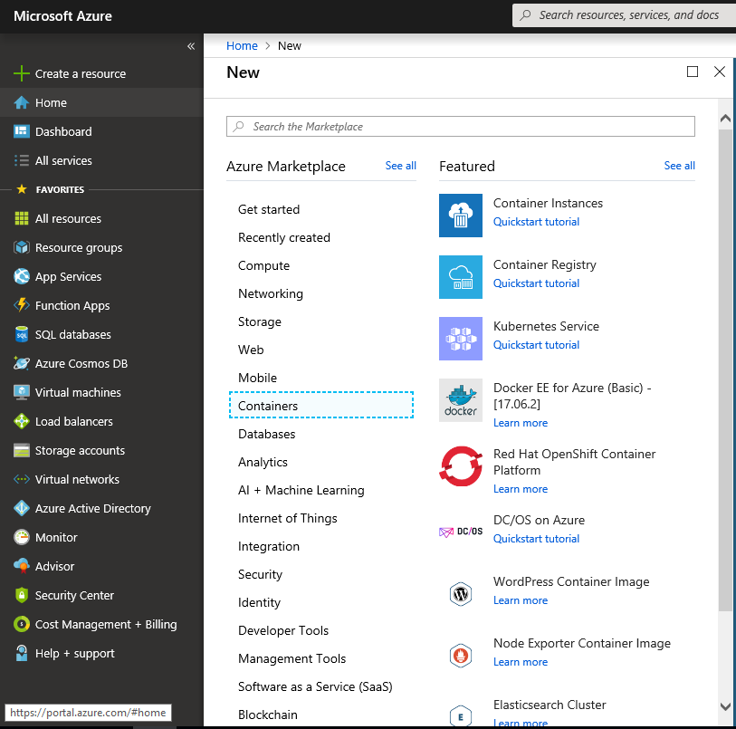
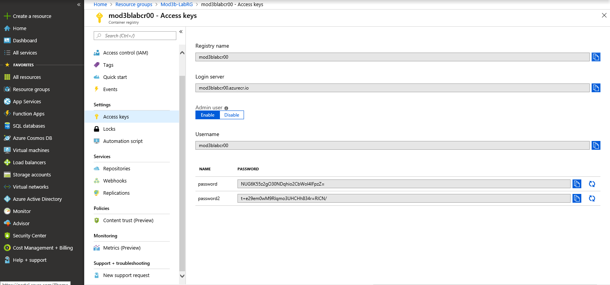

##Exercise 1, Create and prepare VM for Lab 3B
1.	On Main-Lab-VM1, sign in to the Azure management portal.
2.	In the list of options on the far left, click **+Create a resource**.
3.	Click **Compute**, and then type **windows containers** into the search field at the top.
4.	Select **Windows Server 2016 Datacenter – with Containers** from the results, and then click **Create**.
5.	On the Windows Server 2016 Datacenter – with Containers Basics tab, select the following:
a.	Subscription: Select your subscription
b.	Resource group: Click Create new and create a new resource group named **Mod3b-LabRG**
c.	Virtual machine name: **Mod3bLab-vm2**
d.	Region: Select an Azure region where you have the ability to provision Azure VMs. If in doubt, choose East US.
e.	Availability options: default
f.	Image: Windows Server 2016 Datacenter
g.	Size: Click Change Size and select **B2ms**
h.	Username: **Student**
i.	Password: Pa55w.rd1234
j.	Confirm password: Pa55w.rd1234
k.	Under Public inbound ports, select **Allow selected ports**
l.	Under Select inbound ports, check the **RDP (3389)** box
m.	Already have a Windows Server license: No
6.	Turn **OS guest diagnostics** on and accept the defaults everywhere else. Then, click the Next : **Review + create >** button.
7.	In the "Review + create" tab, confirm that the message "Validation passed" appears. 
8.	Click the **Create** button to begin deploying the virtual machine.
9.	Once the VM has been deployed, the VM’s configuration panel will automatically open in the management portal.

##Exercise 2  Create local docker image
1.	In the Virtual Machine panel, click **Connect** to open an RDP session to the VM.
2.	Connect to Mod3bLab-vm2 as Student with a password of Pa55w.rd1234.
3.	Install the Azure CLI as you previously did in Module 1, Lab C.  Remember to restart the computer and RDP back in.
4.	In the Remote Desktop window, right-click the **Windows PowerShell** tile on the Start menu and choose **Run as Administrator**
5.	Type the following commands, pressing Enter after each one.

```powershell
docker images

docker pull hello-world

docker run -it hello-world
```

6.	To see the list of containers on the server and their status, type the following press Enter:

```powershell
docker ps -a –no-trunc
```

##Exercise 3.  Create Azure Container Registry



1.	Open the browser on Modlab5b-vm2 and connect to the Azure Portal.
2.	Click **+Create a resource**.
3.	In the Azure Marketplace, select the containers category on the left, and then, on the right, **Container Registry**.

4.	In the Create a container registry blade, for the name, use **mod3bLabcrXX** (where XX is your assigned student number).  For the Resource Group, use Mod3blab-RG, for the location, choose East US, **Enable** Admin User, and for the SKU, choose **Basic**, and then click **Create**.

5.	When deployment succeeded message is shown, click **Go to resource**.

6.	In the mod3blabcrxx blade, in the Hub menu, click **Access keys**.  Note the Registry name, Login server, Username, and Password.  Note the copy button by the password.  Click the copy button beside the top password.
 
 
 
7.	Return to the PowerShell console, and type the following commands, pressing Enter after each:

```powershell
Az login 

az acr login --name mod3blabcrXX

docker login --username mod3blabcrXX --password <paste from previous copy> mod3blabcrxx.azurecr.io

docker tag hello-world mod3blabcrXX.azurecr.io/hello-world:v1

docker push mod3blabcrXX.azurecr.io/hello-world:v1

docker rmi mod3blabcrXX.azurecr.io/hello-world:v1

az acr repository list --name mod3blabcrXX --output table
```

8.	Return to the Azure portal.  The Access keys blade should still be open.  Note, in the Hub menu the **Repositories** entry below Access keys.  Click Repositories.
9.	You should see the **Hello-world** repository in the list.
10.	Return to PowerShell.  Type the following, followed by the Enter key:

```powershell
docker run mod3blabcrXX.azurecr.io/hello-world:v1
```

11.	The hello-world container will run from the Azure Container Repository.
12.	Close all open windows, and close the RDP connection window to Mod3bLab-VM2.
13.	In Main-Lab-VM1, in the Azure portal, click Resource Groups.
14.	Delete the resource group mod3bLab-RG.
