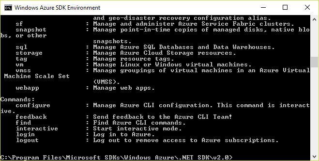

# Module 1: Azure management tools

### Lab C: Deploying an Azure VM using the Azure CLI

In previous labs, you learned how to create Azure VMs using the Azure portal and PowerShell. In this lab, you will create a VM a third way using the [Azure Command-Line Interface](https://docs.microsoft.com/cli/azure/?view=azure-cli-latest), commonly known as the Azure CLI.

```
Perform the exercises in this lab in the Windows Server 2016 VM that you created in Module 1, Lab A.
```



## Exercise 1 - Install the Azure CLI

In this exercise, you will download an installer for the Azure CLI and use it to install the CLI in the VM in which you are working these labs.

1. Open a browser in the VM and navigate to https://docs.microsoft.com/en-us/cli/azure/install-azure-cli-windows?view=azure-cli-latest.

1. Click the **Download the MSI installer** button to download the installer for the Azure CLI. Then run the installer. Accept any terms and conditions presented to you.

1. Restart the VM, and then connect to it again using Remote Desktop.

1. In the VM, launch a Windows Command Prompt as administrator. Then execute the following command to log in to Azure:

	```
	az login
	```

1. When prompted, sign in using your Microsoft account. 

## Exercise 2 - Deploy an Azure VM using the Azure CLI

In this exercise, you will use the Azure CLI to create a new virtual machine in the same region (and of the same size) as the one you deployed in the previous lab. You will also create various resources that support the virtual machine, including a virtual IP address and a virtual network card.

1. Execute the following CLI command in the Command Prompt window to list all the Azure subscriptions associated with your Microsoft account:

	```
	az account show
	```

1. If more than one subscription is listed, use the following command to designate one of them as the default (the one that will be used to create resources in this lab), replacing `<subscription_name>` with the name of that subscription:

	```
	az account set --subscription "<subscription_name>"
	```

1.  Use the following command to identify the Azure region to which you deployed an Azure VM in the previous lab:

	```
	az vm list --query "[?contains(name,'armvm2')].location" --output tsv
	```

1. Now use this command to identify the size of the VM:

	```
	az vm list --query "[?contains(name,'armvm2')].hardwareProfile.vmSize" --output tsv
	```

1. Create a new resource group in the same region as the VM by executing the following command, replacing `<location>` with the location output in Step 3:

	```
	az group create --name mod1c-LabRG --location <location>
	```

1. Use the following command to create a virtual network in the same resource group:

	```
	az network vnet create --resource-group mod1c-LabRG --name mod1c-LabRG-vnet --address-prefix 10.1.0.0/20 --subnet-name default --subnet-prefix 10.1.0.0/24
	```

1.  Create a network security group by executing the following command:

	```
	az network nsg create --resource-group mod1c-LabRG --name mod1c-vm3-nsg
	```

1.  Now create a rule allowing RDP connectivity in the network security group:

	```
	az network nsg rule create --resource-group mod1c-LabRG --nsg-name mod1c-vm3-nsg --name default-allow-rdp --protocol tcp --priority 1000 --destination-port-range 3389 --access allow
	```

1.  Create a virtual public IP address:

	```
	az network public-ip create --resource-group mod1c-LabRG --name mod1c-vm3-ip
	```

1. Create a virtual network interface card:

	```
	az network nic create --resource-group mod1c-LabRG --name mod1c-vm3-nic --vnet-name mod1c-LabRG-vnet --subnet default --public-ip-address mod1c-vm3-ip --network-security-group mod1c-vm3-nsg
	```

1. Use the following command to create a new Azure VM, replacing `<location>` and `<vmsize>` with the Azure region and VM size obtained in Steps 3 and 4:

	```
	az vm create --resource-group mod1c-LabRG --name mod1c-vm3 --location <location> --nics mod1c-vm3-nic --image win2016datacenter --size <vmsize> --admin-username Student --admin-password Pa55w.rd1234
	```

Wait for the VM to be created. Deployment will probably require 10 to 15 minutes.

## Exercise 3 - Verify VM deployment and stop the VM

In this exercise, you will connect to the VM you deployed in the previous exercise, and then stop it to minimize charges to your Azure subscription.

1. Open the [Azure portal](https://portal.azure.com) in your browser.

1.  Click **Virtual Machines** in the menu on the left side of the page. Then click **mod1c-vm3**, which is the virtual machine you deployed in the previous exercise.

1. Click **Connect** at the top of the blade. Then click **Download RDP file** and remote into the VM the same way you did in the first lab. Enter **.\Student** as the user name and **Pa55w.rd1234** as the password.

1. After the VM loads, select **Local Server** in the Server Manager console tree and note the machine name and operating system.

1. Close the Remote Desktop connection.

1. Return to the Azure portal and click the **Stop** button at the top of the blade for the VM to stop the VM.

Upon completion of this exercise, you have successfully deployed an Azure VM by using the Azure CLI.
